# Structures - size, padding, alignment and examples
### Автор: Иван Макавеев
## 0. Въведение и дефиниция
За да разгледаме какво представлява padding-ът и alignment-ът на структурите в C++, първо ще трябва да изясним що е то структура.

**Дефиниция:** Структура (Structure или за по-кратко `struct`) наричаме <u>последователност</u> от полета, които се запазват ("обвиват") в <u>точно определен ред</u> под <u>едно име</u>.

Ключовите думи тук са **последователност**, **точно определен ред** и **под едно име**. Най-лесно можем да си мислим за структурите, като аналог на масивите, но вместо с единствен тип данни, те позволяват групирането на множество стойности от различни типове. 

***Уточнение**: Разбира се, това сравнение с масиви го правим за простота. В същността си структурите имат много по-разширени възможности и употребата им коренно се различава от тази на масивите. Докато масива е просто колекция - последователност от елементи (наредена n-торка) при това от един и същи тип, то структурите се използват за "моделиране" на един обект чрез данните, които го описват (неговите полета), както и предоставят възможност за добавяне на функционалност към конкретния обект. По-напред в курса по ООП ще разгледаме какво точно имаме предвид с това.* 

## 1. Репрезентация на структурите в паметта
Аналогично на масивите, полетата на структурите са разположени в точно определен ред в паметта, като този ред съответства на реда, в който полетата са подредени при дефиниране на структурата. Нека разгледаме следния пример:

```c++
struct MyStruct
{
    char symbol;
    short number;
    int count;
};
```

В дефиницията на структурата сме изброили 3 полета:
- поле `symbol` от тип `char` (1 Byte)
- поле `number` от тип `int` (4 Bytes)
- поле `count` от тип `double` (8 Bytes)

Следователно в паметта те ще бъдат в точно този ред - първо задължително ще бъде `symbol`, след това ще бъде `number` и накрая ще бъде `count`.

**Правило 1: Редът на полетата в паметта съответства на реда им при дефиниране на функцията!***

Със знанията, които имаме за масиви, логично би било да предположим, че полетата ще са непосредствено едно до друго в паметта. Примерно, нещо такова:

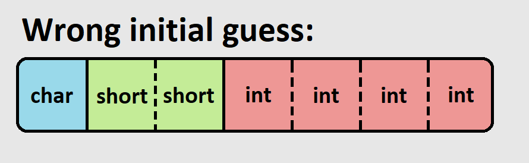

За жалост това предположение **НЕ** е вярно. За разлика от масивите, полетата на структурите не винаги са разположени непосредствено едно до друго в паметта.

Това се дължи на начинът, по който CPU-то на компютъра достъпва информацията от паметта. За да бъде оптимизирано четенето, данните не се достъпват байт по байт, ами се извличат по няколко (най-често под формата на т. нар. думи, които имат размер - степен на двойката, често 4 или 8). Поради тази причина данните трябва да бъдат разположени на точно определени адреси в паметта, за да се избегне частичното им прочитане. Този проблем е най-видим, когато създадем масив от нашата примерна структура:
```c++
MyStruct arrayOfStructures[2];
```

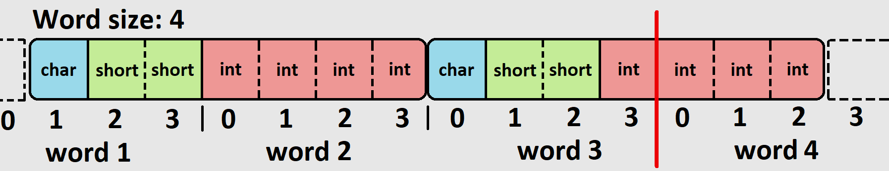

Нека допуснем, че работим с думи от по 4 байта (на фигурата са индексирани от 0 до 3 за всеки байт от думата) и първият ни елемент е коректно разположен в паметта (всяко поле изцяло се разполага в точно една дума). Тогава ще видим, че още при следващия елемент от нашия масив от `MyStruct`-ове ще имаме проблем - полето от тип `int` се разпокъсва между две думи.

*Уточнение: Не започваме от байта с индекс 0 на word1, защото искаме така да се подредят полетата, че в word2 изцяло да влезе integer стойността. Това идва от допускането по-горе, че първият елемент на масива е коректно разположен в паметта.*

За получаване на желаното разположение на полетата в паметта, трябва да бъдат изпълнени още няколко правила:

**Правило 2: Големината на структурата трябва да се дели на *size*-а на най-големия примитивен тип данни в нея**

**Правило 3: Всяка член-променлива (поле) трябва да е на позиция (адрес), деляща се на *alignment*-а й.**

В горните две правила можем да забележим, че сме използвали две чуждици, а именно *size* и *alignment*. С помощта на тези две думи, ще разгледаме как точно са представени структурите в паметта.

## 2. Size и Alignment
Ще започнем от по-простата и интуитивна дефиниция:

**Дефиниция:** Size (Големина или Размер) наричаме количеството памет (в случая измервано в байтове), което дадена структура заема.

За примитивните типове size-ът е съответно:
- bool: 1 Byte
- char: 1 Byte
- short: 2 Bytes
- int: 4 Bytes
- float: 4 Bytes
- double: 8 Bytes
- long long: 8 Bytes

*Уточнение: Има леки разлики в големините в някои случаи. За целите на този документ приемаме горните размери за верни.*

**Дефиниция:** Alignment (Подравняване) наричаме число, показващо на колко трябва да се дели адрес в паметта, за да запишем там дадена структура.

**За примитивните типове alignment-ът съвпада с техния size!**

Лесно стойностите за size и alignment могат да бъдат проверени с вградените оператори в C++ `sizeof()` и `alignof()`.

Използвайки правилата от горната точка, както и дефинициите за size и alignment, вече можем да разгледаме как наистина се представя нашата структура в паметта:

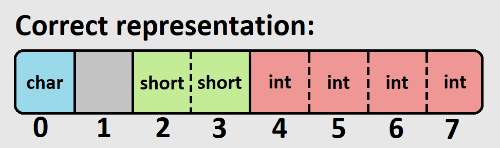

Нека анализираме фигурата:
- Полетата са подредени в същия ред, както при дефиницията на структурата. *(Правило 1)*
- Структурата има големина size = 8, която се дели на size-а на най-големия примитивен тип данни в нейната дефиниция. *(Правило 2)*
- Полето от тип char е на позиция 0, което е валидно за тип с alignment 1. *(Правило 3)*
- Полето от тип short зпочва от позиция 2, което е валидно за тип с alignment 2. *(Правило 3)*
- Полето от тип int започва от позиция 4, което е валидно за тип с alignment 4. *(Правило 3)*

Забелязваме един празен адрес между `char` и `short`. Такава празна позиция се нарича **padding byte** (или просто **padding**). Тъй като заделената памет няма как да бъде разпокъсана на части (трябва да бъде един непрекъснат блок), padding-ът служи за "пълнеж" на тези позиции, на които поради ограниченията от правилата не можем да сложим нито едно поле от структурата. 

Целият процес по получаване на репрезентацията на структура в паметта се нарича **structure padding** (или отново просто **padding**, което понякога води до объркване - в единия случай е съществително, а в другия е глагол).

Виждаме, че всички правила са изпълнени за нашата структура. Възниква въпросът обаче, щом тя има size = 8, какъв е нейният alignment? Отговорът е много прост:

**Alignment-ът на структура е равен на най-големия alignment на нейните полета.**

В случая `MyStruct` ще има alignment = 4.

```c++
sizeof(MyStruct) // Will be 8
alignof(MyStruct) // Will be 4
```

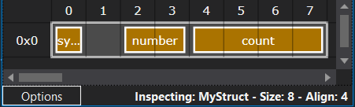

*Горната фигура е генерирана с помощта на Visual Studio Extension - Struct Layout*

**Следствие:** Alignment-ът може да се разгледа рекурсивно спрямо нивото на влагане на структурите, като се достига до следния извод: **"alignment-ът на структура е равен на най-големия alignment на примитивен тип, съдържащ се къде да е вътре нея."**

Още еднин основен случай, който трябва да разгледаме, е когато трябва да поставим **padding в края** на структурата. Нека разгледаме следният пример:

```c++
struct EndPaddedStruct
{
    int number;
    char symbol;
};
```

Ще анализираме как би изглеждала структурата в паметта:
1. Полетата трябва да бъдат разположени в паметта точно в този ред (от Правило 1).
2. Започваме с полето `number` от тип `int`. То има alignment = 4 и трябва да е на адрес кратен на 4. Първата свободна такава е позиция 0.
3. Продължаваме с поле `symbol` от тип `char`. То има alignment = 1 и може да е на кой да е адрес. Следващата свободна позиция ще бъде позиция 4.
4. Между двете полета няма да има **padding bytes**, тъй като са разположени непосредствено едно след друго.
5. Остава ни да си подсигурим и Правило 2 - размерът на структурата да се дели на размера на най-големия примитивен тип в нея. Към момента `EndPaddedStruct` има размер 5 байта, а най-големият примитивен тип в нея е `int` и има размер 4 байта. Следователно трябва да добавим още 3 байта **padding** в края на структурата.

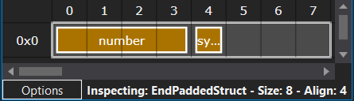

Наистина се оказва, че в края на структурата остават 3 байта неизползвана памет, поради ограниченията, наложени ни от правилата за padding. Тоест padding bytes може да има както между две полета, така и в края на структурата. 

## 3. Структури с масиви и вложени структури

След като се запознахме с правилата за padding на структура в най-базовия случай, нека разгледаме какво ще стане, ако работим с непримитивни типове. Ще разгледаме следният пример за структура с масив за поле:

```c++
struct MyArrayStruct
{
    char arr[3];
    short number;
    double count;
};
```

В случаите, когато имаме масив за поле на структура, за да ни е по-лесно, можем да си мислим за всеки елемент от масива като отделно поле. Тогава, нашата структура би имала вид:

```c++
struct MyArrayStructSimplified
{
    char arr_0;
    char arr_1;
    char arr_2;
    short number;
    double count;
};
```

В този си вид вече нямаме накакъв проблем да открием как ще бъде представена тази структура в паметта:

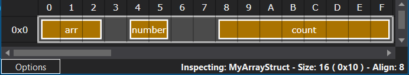

Най-отпред имаме три байта за всеки един от `char`-овете (те имат alignment = 1 и могат да са на коя да е позиция). След това имаме един празен **padding byte** и след това на адрес 4 чак можем да поставим полето от тип `short` (тъй като има alignment = 2 и се нуждае от четен адрес). Поставяме още два padding byte-а, за да достигнем адрес 8, където можем да поставим и последното поле от тип `double` (тъй като има alignment = 8). Цялата структура има:
- size = 3 * 1B + 1B + 2B + 2 * 1B + 8B = 16B (16 Bytes)
- alignment = 8B (колкото е най-големият alignment на поле - в случая на `double` е 8)

Най-важното, което трябва да се запомни, е че **масивите не са примитивен тип** и мислено можем да си ги представим просто като няколко последователни член-променливи от един и същи тип.

Нещата стоят по малко по-различен начин, когато искаме да влагаме структури. Ще разгледаме примера:

```c++
struct Inner
{
    char ch;
    int num;
};

struct Outer
{
    char symbol;
    Inner in;
    double value;
};
```

Ще започнем, като анализираме структурата `Inner`, тъй като тя съдържа само полета от примитивни типове. Тя ще има следната репрезентация в паметта:

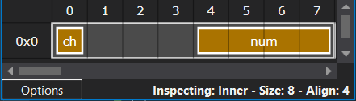

Тя има следното разположение на полетата:
1. полето `ch` от тип `char` има alignment = 1 и може да е на коя да е позиция, затова заема първата свободна такава - позиция 0.
2. полето `num` от тип `int` има alignment = 4 и може да се разположи на позиция кратна на 4. Първата свободна такава позиция ще бъде позиция 4.
3. между `ch` и `num` имаме три **padding bytes**, за да запълнят неизползваните адреси между двете полета
4. крайният размер излиза size = 8, което се дели на размера на най-големия примитивен тип в структурата и затова няма нужда от padding в края.

От горното описание става ясно, че структурата `Inner` ще има:
```c++
sizeof(Inner) // Will be 8
alignof(Inner) // Will be 4
```

По интересно става разположението в паметта на структурата `Outer`. На база разглежданите до сега примери и техните анализи, нека опитаме да съставим обосновано предположение какъв вид ще има тази структура в паметта:

1. полето `symbol` от тип `char` има alignment = 1 и може да е на коя да е позиция, затова заема първата свободна такава - позиция 0.
2. полето `in` от тип `Inner` има alignment = 4 (както пресметнахме по-горе) и може да се разположи на позиция кратна на 4. Първата свободна такава позиция ще бъде позиция 4.
3. между `symbol` и `in` имаме три **padding bytes**, за да запълнят неизползваните адреси между двете полета (адрес 1, 2 и 3).
4. полето `value` от тип `double` има alignment = 8 и може да се разположи на позиция кратна на 8. Тъй като `in` започва от адрес 4 и достига до адрес 11 (големината на `in` пресметнахме, че е 8 байта), то първата свободна позиция ще бъде 16.
5. между `in` и `value` имаме четири **padding bytes**, за да запълнят неизползваните адреси между двете полета (адрес 12, 13, 14, 15)
6. крайният размер излиза size = 24, което се дели на размера на най-големия примитивен тип в структурата и затова няма нужда от padding в края.

Нека проверим дали предположението ни е вярно:

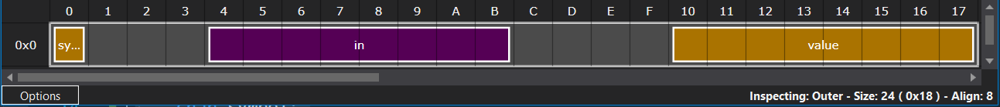

В действителност предположението ни съвпада с репрезентацията на структурата `Outer` в паметта. Структурата заема общо 24 адреса, а нейният alignment ще бъде равен на най-големият примитивен тип къде да е в нея (в случая - double).

```c++
sizeof(Outer) // Will be 24
alignof(Outer) // Will be 8
```

Ако разгледаме и полетата на вложената структура, можем да видим, че правилата за разположението на примитивните типове в паметта остава в сила и за тях - всяко поле от примитивен тип е на адрес, кратен на alignment-а си.

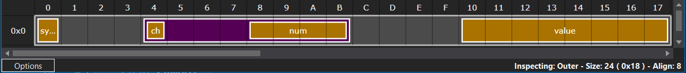

За пълнота ще разгледаме и пример, когато alignment-ът на външната структура зависи от този на вътрешната. Новите структури, които ще разгледаме са:

```c++
struct Inner
{
    char ch;
    double num;
};

struct Outer
{
    char symbol;
    Inner in;
    int value;
};
```

Отново ще проследим стъпките за получаване на репрезентацията на структурата в паметта.

За `Inner`:
1. полето `ch` от тип `char` има alignment = 1 и може да е на коя да е позиция, затова заема първата свободна такава - позиция 0.
2. полето `num` от тип `double` има alignment = 8 и може да се разположи на позиция кратна на 8. Първата свободна такава позиция ще бъде позиция 8.
3. между `ch` и `num` имаме седем **padding bytes**, за да запълнят неизползваните адреси между двете полета
4. крайният размер излиза size = 16, което се дели на размера на най-големия примитивен тип в структурата и затова няма нужда от padding в края. Цялата структура има alignment равен на 8 - колкото най-големия alignment на полетата в нея.

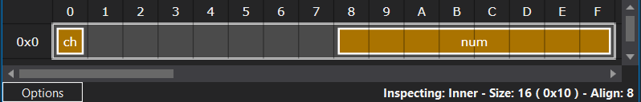

За `Outer`:
1. полето `symbol` от тип `char` има alignment = 1 и може да е на коя да е позиция, затова заема първата свободна такава - позиция 0.
2. полето `in` от тип `Inner` има alignment = 8 (както пресметнахме по-горе) и може да се разположи на позиция кратна на 8. Първата свободна такава позиция ще бъде позиция 8.
3. между `symbol` и `in` имаме седем **padding bytes**, за да запълнят неизползваните адреси между двете полета (адреси 1 до 7).
4. полето `value` от тип `int` има alignment = 4 и може да се разположи на позиция кратна на 4. Тъй като `in` започва от адрес 8 и достига до адрес 23 (големината на `in` пресметнахме, че е 16 байта), то първата свободна позиция ще бъде 24.
5. между `in` и `value` нямаме **padding bytes**. 
6. размерът излиза size = 28, което не се дели на размера на най-големия примитивен тип в структурата и затова ще има допълнителен padding в края равен на още 4 байта. Цялата структура има краен size = 32 и alignment = 8 - колкото най-големия alignment на полетата в нея (в случая на полето от тип `Inner`).

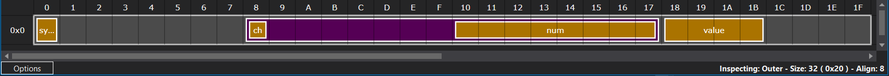

Целта на примерите с вложените структури е да демонстрират коректността на правилата, когато се приложат за вложени структури. **Alignment**-ът играе ключова роля при изчислението на разположението на всяко от полетата, тъй като гарантира, че всяко поле на вложените структури ще се намира на правилен адрес. Няма да разглеждаме теоретично доказателство, но индуктивно може да се покаже, че винаги при коректно пресметнат и съобразен alignment, структурата ще изпълнява всяко едно от описаните правила за padding на структурата в паметта.

## 4. Прилагане на правилата за padding и особености

Ще разгледаме някои по-интересни случаи за прилагане на правилата за padding, както и съответните им особености и причини за тяхното съществуване.

Първият интересен случай е когато имаме празна структура:

```c++
struct EmptyStruct
{

};
```

Човек, който не се е занимавал с програмиране, би предположил, че големината на такава структура следва да е 0 байта. Все пак щом няма данни - не би следвало да има и заделена памет за тях. Това обаче **НЕ** е така!

В C++ е забранено на един адрес от паметта да се разполага повече от един обект. Най-просто казано, даден адрес от паммета на нашата програма има точно две състояния - "е заделен" или "не е заделен". Ако допуснем създаването на структура с нулева големина (size = 0), то тогава започвайки от адрес ***X*** можем да заделим памет за нашата структура. Но реално ние ще заделим 0 байта. Тогава този адрес би трябвало да се счита за "е заделен", но същевременно обект там няма (не е заета никаква памет) и ще можем отново да заделим този адрес от паметта за нещо друго. Точно поради този проблем имаме следното допълнително правило:

**Правило 4: Минималният size и alignment на структура е 1 байт.** 

От където следва, че `EmptyStruct` заема точно 1 байт и има alignment 1.

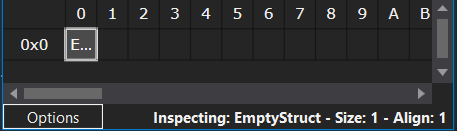

Вторият по-интересен случай се получава благодарение на една концепция, наследена от C. Тя се нарича **flexible array member** и гласи следното: ***"Ако последното поле на структура е масив, то можем да не задаваме експлицитно размера му. Масивът ще съдържа толкова елементи, колкото могат да се съберат в оставащия в края на структурата padding, без да се нарушат правилата за padding на структурата"***. Това е екзотичен случай с доста особености, но е добре човек да го е срещал и него.

Ще разгледаме следният пример:

```c++
struct FlexMemberStruct
{
    int number;
    char symbol;
    char arr[];
};
```

Най-лесно можем да анализираме разположението в паметта на тази структура, ако си представим, че последното поле (flex array member) го няма. Тогава ще имаме структура от видя:

```c++
struct FlexMemberStructSimplified
{
    int number;
    char symbol;
};
```

В примерите по-горе сме разглеждали вече как изглежда подобна структура, но нека отново я разгледаме на фигура:


Вижда се, че стурктурата има три свободни байта в края. Тогава би следвало във `FlexMemberStruct` последните три байта да са заети от полето `char arr[]`.

Поради ограничения на инструмента *Struct Layout* не можем да ги визуализираме в IDE-то, но долната фигура изобразява репрезентацията на структурата `FlexMemberStruct` в паметта:

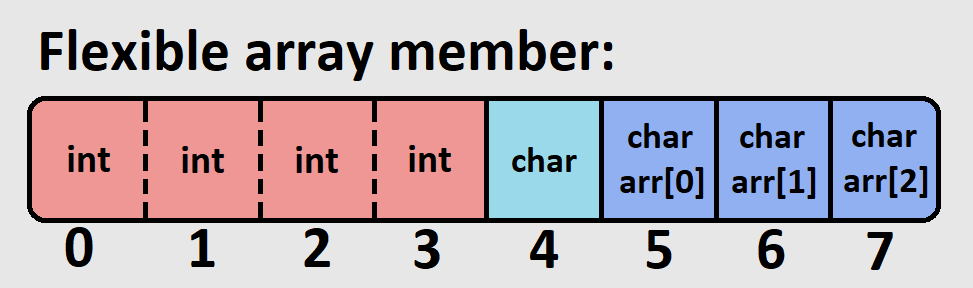

Важно е да отбележим една особеност - когато нямаме достатъчно padding bytes, за да поберем елемент от типа на flexible array member-а, то размерът на мазива ще бъде равен на 0. С други думи - ако няма място за елементи от даден тип в края на структурата, то при зададен flexible array member от същия този тип, масивът няма да съдържа елементи.

```C++
struct FlexNoElements
{
    int number;
    char symbol;
    int arr[];
}
```

В горният пример структурата `FlexNoElements` няма достатъчно място да побере елемент от тип `int` в края си и затова `arr` ще бъде масив с размер 0:


Също така, елементите на flexible array member също трябва да следват правилата за коректен alignment на полетата:

```C++
struct FlexAlignment
{
    int number;
    char symbol;
    short arr[];
}
```

В структурата `FlexAlignment` елементите на `arr` са от тип `short` и затова трябва да започнат своето изреждане от индекс кратен на 2:

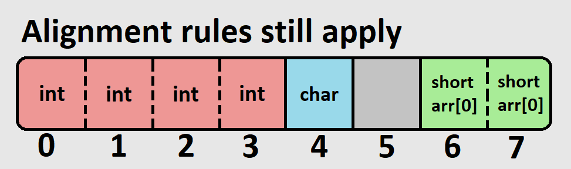